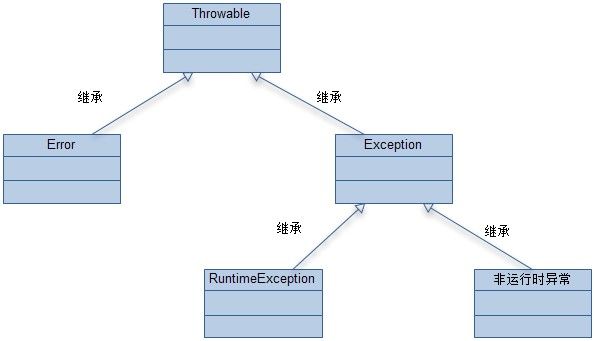

1. Comparable和Comparator区别

   **Comparable:**

   Comparable可以认为是一个**内比较器**，实现了Comparable接口的类有一个特点，就是这些类是可以和自己比较的，至于具体和另一个实现了Comparable接口的类如何比较，则依赖compareTo方法的实现，compareTo方法也被称为**自然比较方法**。如果开发者add进入一个Collection的对象想要Collections的sort方法帮你自动进行排序的话，那么这个对象必须实现Comparable接口。compareTo方法的返回值是int，有三种情况：

   1、比较者大于被比较者（也就是compareTo方法里面的对象），那么返回正整数

   2、比较者等于被比较者，那么返回0

   3、比较者小于被比较者，那么返回负整数

   **Comparator**:

   Comparator可以认为是是一个**外比较器**，个人认为有两种情况可以使用实现Comparator接口的方式：

   1、一个对象不支持自己和自己比较（没有实现Comparable接口），但是又想对两个对象进行比较

   2、一个对象实现了Comparable接口，但是开发者认为compareTo方法中的比较方式并不是自己想要的那种比较方式

   Comparator接口里面有一个compare方法，方法有两个参数T o1和T o2，是泛型的表示方式，分别表示待比较的两个对象，方法返回值和Comparable接口一样是int，有三种情况：

   1、o1大于o2，返回正整数

   2、o1等于o2，返回0

   3、o1小于o3，返回负整数

   **总结**

   总结一下，两种比较器Comparable和Comparator，后者相比前者有如下优点：

   1、如果实现类没有实现Comparable接口，又想对两个类进行比较（或者实现类实现了Comparable接口，但是对compareTo方法内的比较算法不满意），那么可以实现Comparator接口，自定义一个比较器，写比较算法

   2、实现Comparable接口的方式比实现Comparator接口的耦合性要强一些，如果要修改比较算法，要修改Comparable接口的实现类，而实现Comparator的类是在外部进行比较的，不需要对实现类有任何修改。从这个角度说，其实有些不太好，尤其在我们将实现类的.class文件打成一个.jar文件提供给开发者使用的时候。实际上实现Comparator接口的方式后面会写到就是一种典型的**策略模式**。

2. 不可变类Immutable

   什么是不可变类：

   1. 该类的实例对象一旦创建，则其成员变量的值就无法改变，即对象的状态一旦创建则无法改变
   2. 基本类型的包装类和String类都是不可变类
   3. 不可变类是线程安全的
   4. 不可变类的对象非常适合做Map对象的Key

   如何设计一个不可变类：

   1. 类声明为final，不能被继承
   2. 类中的成员变量声明为final和private
   3. 不提供改变成员变量的方法
   4. 通过构造器初始化话成员变量时，如果传入的是引用类型，则需要进行深拷贝(`clone()`方法)
   5. 对象必须被正确的创建，**对象引用在对象创建过程中不能泄露**

3. 对象逃逸

4. Void类：void关键字的包装类，用于标记返回类型为void。反射或者泛型中可以标记对应类型为Void。该类使用final修饰，并且构造器为private，不可以被实例化。

5. static成员变量/代码块、main方法、final属性、普通成员变量/普通代码块、构造器的初始化顺序，及父子类之间的执行顺序  

  1. 对于有继承关系的类来说，都是按照执行顺序先执行父类中的初始化。如先执行父类中的static代码块 -> 子类中的static代码块 -> 父类中的static成员变量 -> 子类中的static成员变量... 
     **static代码块和static成员变量按照代码顺序执行**，它们之间的执行顺序按照代码的顺序从上到下按顺序执行，**然后main方法执行**，**之后再是final属性、普通代码块和普通成员变量执行**，它们之间也是按照代码的顺序从上到下依次执行，**最后构造器执行**。  
     
  7. 被final/static修饰的方法不涉及到初始化的过程。    

  3. Main方法启动时，会先执行各个类中的static修饰的代码，之后再执行Main方法中的代码。

6. private关键字修饰的**方法**默认被final修饰

10. static方法的调用会触发该类中static修饰的属性和代码块的执行，但是对于final属性、普通成员变量和普通代码块都不会执行。

11. java异常处理

    

    1. 异常分类

       1. Error，程序中无法处理的异常，例如OOM，一般发生这种异常，JVM会选择终止程序
       2. Exception，包括RuntimeException(非检查异常、运行时异常、unchecked exception)和检查异常(非运行时异常、checked exception)
          1. RuntimeException：运行时异常，对于这类异常可以在程序中不进行处理，如NullPointException、IndexOutOfBoundsException
          2. checked exception：非运行时异常，程序中必须进行处理，如IOException、SQLException

    2. 异常处理

       1. try...catch...finally...，catch代码块中对捕获的异常进行处理，注意，**如果finally中有return语句，则会把try...catch...中的return语句覆盖掉**

       2. throw，手动抛出异常

       3. throws，在方法体中声明抛出的异常，告知该方法的调用者该方法可能会出现的异常

          + 如果抛出的异常对象是非运行时异常，此方法的调用者必须显示地用try..catch块进行捕获或者继续向上层抛出异常。

          + 如果抛出的异常对象是运行时异常，此方法的调用者可以选择地进行异常捕获处理。

    3. 异常使用建议

       1. 只有在必要使用异常的地方才使用异常，不要使用异常去控制程序的流程

       2. 不要使用空的catch块，这样就意味着一类异常忘记了处理

       3. 检测异常和非检查异常的选择，检测异常因为必须要在代码中进行处理，所以当逻辑代码很少时，而异常处理代码的逻辑很多时会导致代码不易阅读，而且会降低程序的性能。

          **在一般情况下，尽量将检查异常转变为非检查异常交给上层处理。**

          ```java
          try {
          	...
          } catch(检查异常) {
          	throw new 非检查异常();
          } finally {
          	...
          }
          ```

       4. 注意catch块的顺序，将子类异常放到父类异常上面处理
       
       5. 避免在日志信息中多次记录同一个异常，即**只在异常最开始发生的地方进行日志信息记录**，而不是每次抛出异常时都记录，这样导致查找异常发生的根源是很困难
       
       6. **异常处理尽量放到高层处理**，尽量将异常统一抛给上层调用者，由上层调用者统一处理异常。
       
       7. **在finally中释放资源**，如果有I/O处理、网络操作以及数据库操作等，将这些资源在finally语句中进行释放。
    
12. `Object`类中的方法

    1. `toString()`
    2. **`equals()`**
    3. **`hashCode()`**
    4. `wait()`
    5. `wait(long time)`
    6. `notify()`
    7. `notifyAll()`
    8. `finalize()`
    9. **`getClass()`**


参考：

1. 不要让你的Java对象"逃逸"了！https://blog.csdn.net/zxm317122667/article/details/105804078