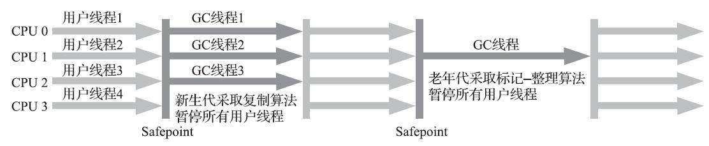

1. java内存区域

   1. 运行时数据区域

      

      1. 程序计数器(Program Counter Register)：**当前线程所执行字节码的行号指示器。**

      2. Java虚拟机栈：描述的是Java方法执行的内存模型，**当前线程私有。**

         每个方法在执行的同时都会创建一个栈帧，用于存储局部变量表、操作数栈、动态链接、方法出口等信息。局部变量表存放了编译期可知的各种基本数据类型(boolean、byte、char、short、int、float、long、double)、对象引用和returnAddress类型(指向了一条字节码指令的地址)。-Xss设置栈内存大小

         **该区域会发生两类异常：StackOverflowError和OutOfMemoryError。**

      3. 本地方法栈：**为本地方法(native method)服务**，作用同Java虚拟机栈，**同样也会出现StackOverflowError和OutOfMemoryError异常**。`-Xoss`设置本地方法栈大小。

      4. Java堆：**线程共享的区域，存放对象实例。会出现OutOfMemoryError异常。**`-Xmx`堆最大内存大小，`-Xms`堆最小内存大小。

      5. 方法区：**线程共享的区域，用于存储已被虚拟机加载的类信息、常量、静态变量、即时编译期编译后的代码等数据。这部分内存区域也会出现OutOfMemoryError异常。**JDK7之后，字符串常量池由方法区搬到了堆区中。JDK8之前HotSpot的实现是永久代，JDK8之后使用元空间。

      6. 运行时常量池：方法区的一部分。存放编译期生成的各种字面量和符号引用。注意，常量不一定只有编译期才能产生，运行期也可能将新的常量放入池中，例如String类的intern()方法。

      7. 直接内存：NIO可以使用Native函数库直接分配堆外内存，然后通过一个存储在堆内的对象作为这块内存的引用，用于提高操作性能。该块内存不受堆内存大小的限制，但是因为是动态申请的，所以也会出现**OutOfMemoryError**。`-XX:MaxDirectMemorySize`参数设定直接内存大小，如果不设定的话，默认与Java堆的最大值一致。

2. 对象的创建

   

3. 栈内存如何操作堆内存中的对象

   1. 使用句柄

      

      句柄中包含对象实例数据的指针和对象类型数据的指针，这样访问对象需要通过二次指针定位，但是在GC后，对象地址移动后，reference的值不用改变。

   2. 直接指针

      

      可以直接通过reference的值访问到对象，但是需要考虑对象类型数据的存放，并且GC之后，reference的值也需要改变。HotSpot采用的是这种方式。

4. 判断对象不可用的算法

   1. 引数计数算法

      

      每当一个对象有地方引用时，该对象的引用计数器就加一。对象的引用计数器为0时，就表示该对象不可用。存在的问题是：当对象间相互引用时，这些对象的引用计数器永远都不会为0，最终导致，这些对象永远不会被回收。

   2. **可达性分析算法**

      **一个对象不能到达GC Root的话，说明该对象是不可用的。**

      **GC Root：**

      1. 虚拟机栈中本地变量中引用的对象
      2. 方法区中静态变量引用的对象
      3. 方法区中常量引用的对象
      4. 本地方法栈中(JNI，即Native方法)引用的对象
   
5. 引用的类型

   1. 强引用(Storage Reference)
   2. 软应用(Soft Reference)
   3. 弱引用(Weak Reference)
   4. 虚引用(Phantom Reference)

6. 判断一个对象是否死亡的过程

   

   注意：

   	1. finalize()方法只会被执行一次
   	2. 因为有可能finalize()方法中存在死循环，或者极其耗时的操作，为了不影响整个内存回收系统的崩溃，所以Finalizer线程并不能保证finalize()方法能够执行完成
   	3. finalize()中可以将自身(this)赋值给GC Root，保证此次对象不被回收。
   	4. 非常不建议使用finalize()方法！使用try-finally或者其他方法都可以替代finalize()方法中所实现的功能！

 7. 方法区的回收

     1. 回收的对象
         1. 废弃常量：没有任何对象引用方法区中的常量
         2. 无用的类：
             1. 该类所有的实例都已经被回收，Java堆中不存在该类的任何实例
             2. 加载该类的ClassLoader已经被回收
             3. 该类对应的java.lang.Class对象没有在任何地方被引用，无法在任何地方通过反射访问到该类的方法。

 8. **垃圾收集算法**

    1. **标记-清除算法**：

       

       标记出所有需要回收的对象，在标记完成后统一回收所有被标记的对象。

       缺点：

       1. 标记和清除的**效率都不高**
       2. 标记清除之后会**产生大量的不连续的内存碎片**，如果碎片过多的话导致以后程序在运行过程中需要分配较大的对象时，无法找到足够的连续内存，从而导致提前触发另一次垃圾收集操作。

    2. **复制算法：**

       

       将可用内存按照容量划分为大小相等的两块，每次只使用其中的一块，当这一块内存使用完之后，将还存活的对象复制到另一块内存中，再把已使用过的内存空间清理掉。

       **HotSpot虚拟机采用这种收集算法来回收新生代，新生代内存划分为Eden和两块Survivor空间，内存比例为8:1:1，其中Survivor空间一块为可用的，一块为待用的，当回收时，将Eden和使用的Survivor空间中的对象复制到待用的Survivor中，如果待用的Survivor内存不够用时，需要依赖其他内存(老年代)进行分配担保(Handle Promotion)。**

    3. **标记-整理算法：**

       

       标记过程与标记-清除算法相同，整理时，将存活的对象移动到内存的一端，然后直接清除掉端边界以外的内存空间。

    4. **分代收集算法：**

       按照对象存活周期的不同，将内存空间分为几类。不同的内存空间中采用不同的收集算法。例如新生代中采用复制算法，老年代采用标记-清理或标记-整理算法。

9. **空间分配担保**

     新生代中采用的是复制算法，suvivor区的空间比eden区小很多，如果某次eden区中存活的对象比suvivor区的空间大的话，就需要暂时借用老年代的空间，这种做法就是空间分配担保。

     空间分配担保会涉及到gc的类别。在gc前，jvm会检查老年代最大可用的连续空间是否大于新生代所有对象总空间。如果是成立的，则本次Minor GC是安全的；如果不成立，则看HandlePromotionFailure设置是否允许担保失败。如果允许，那么检查老年大最大可用空间是否大于历次晋升到老年代对象的平均大小，如果大于，则进行Minor GC，如果在Minor GC时，空间不足了，那么再进行Full GC。如果小于，或者HandlePromotionFailure设置不允许担保失败，则进行Full GC。

     JDK6 Update24之后，HandlePromotionFailure参数失效，只要老年代的连续空间大小大于新生代对象总大小或者历次晋升的平均大小就会进行Minor GC，否则将进行Full GC。

10. HotSpot算法的实现

   

   1. 枚举根节点
   2. 安全点
   3. 安全区域
   4. Stop The World
   5. OopMap
   6. 记忆集
   7. 三色标记
   8. 增量更新/原始快照

11. 垃圾收集器

        

        1. Serial收集器

           

           虚拟机运行在**client模式下默认的新生代收集器，使用标记-复制算法。**特点是**单线程**完成垃圾收集工作，简单高效。缺点是Stop The World发生时间久，并且频繁。

        2. parNew收集器

           

           **新生代收集器，Serial收集器的多线程版本，使用标记复制算法，因为是除了Serial收集器之外，唯一一个可以和CMS收集器配合使用的收集器，因此是Server模式下虚拟机首选的新生代收集器。**

           1. 使用`-XX:+UseConcMarkSweepGC`选项后默认的新生代收集器
           2. `-XX:+UseParNewGC`强制使用parNew收集器，**JDK9之后取消了这个参数**
           3. 默认情况下开启和主机CPU核数相同的线程数，而线程数太多的情况下不一样会有更高的效率，可以使用`-XX:ParallelGCThreads`参数来限制垃圾收集的线程数
           4. JDK8时，Serial和CMS的组合、ParNew和Serial Old的组合被标记为废弃，JDK9后，这两个组合被完全放弃，意味着，使用CMS时，只能使用ParNew作为新生代的垃圾收集器。

        3. Parallel Scavenge收集器，吞吐量优先收集器

           

           **新生代，并发收集的多线程收集器，使用标记-复制算法，目标是达到一个可控吞吐量。**

           1. `-XX:MaxGCPauseMills`：控制最大垃圾收集停顿时间，时间设置小了，会导致收集的频率高，也会影响系统的整个吞吐量
           2. `-XX:GCTimeRatio`：设置吞吐量大小，垃圾收集时间占总时间的比率，默认99，即允许最大1%(1/(1 + 99))的垃圾收集时间
           3. `+UseAdaptiveSizePolicy`：开启垃圾收集的自适应的调节策略。JVM会根据当前系统的运行情况收集性能监控信息，动态调整这些参数以提供最合适的停顿时间或者最大的吞吐量
           4. `-XX:+UseParallelGC`：JDK7U4开始，新生代默认使用Parallel Scavenge收集器，老年代默认使用Parallel Old收集器。注意jconsole/jvisualVM界面不一定是对的。
           5. 默认情况下，CPU数量小于8时，垃圾回收线程数等于CPU的数量；大于8时，为3 + (5 * cpu_count) / 8。可以使用-XX:ParallelGCThreads设置垃圾回收线程数。

        4. Serial Old/Ps MarkSweep收集器

           **老年代收集器，Serial收集器的老年代版本，单线程收集器，使用标记-整理算法。**主要是供客户端模式下的HotSpot虚机使用，在服务端模式下，可以和PS收集器搭配使用，还有就是在CMS收集器发生失败时的后备预案。

        5. Parallel Old收集器

           

           **老年代收集器，Parallel Scavenge收集器的老年代版本，多线程收集，使用标记-整理算法。**配合parallel Sacvenge收集器使用。

       6. CMS(Concurrent Mark Sweep)收集器

          

          **老年代收集器，以获取最短回收停顿时间为目标的收集器，使用标记-清除算法。组合为ParNew + CMS + Serial Old。**收集过程分为：

          1. 初始标记(CMS Initial Mark)：标记一下GC Roots能直接关联的对象，速度很快，需要Stop The World
          2. 并发标记(CMS Concurrent Mark)：从GC Roots直接关联的对象开始遍历整个对象图的过程，整个过程很耗时，但是不需要停顿用户线程
          3. 重新标记(CMS Remark)：修正在并发标记期间，因用户线程导致标记产生变动的那一部分对象的标记记录，需要Stop The World，停顿时间通常会比初始标记稍长一些
          4. 并发清除(CMS Concurrent Sweep)：清理删除标记阶段被判断已经死亡的对象，由于不需要移动存活对象，所以这个阶段也是和用户线程同时并发的

          特点：

          1. 默认启动的线程数为`(核心线程数 + 3) / 4`，如果处理器核心线程数小于4个的话，垃圾回收线程会占用系统很大一部分资源，导致应用程序变慢。虚拟机提供了一种***“增量式并发收集器”(Incremental Concurrent Mark Sweep，i-CMS)***，让垃圾回收线程和用户线程交替运行，这样虽然减少了垃圾回收线程独占资源的时间，但是会使垃圾回收的整个过程变长。i-CMS实际效果一般，JDK7时，被声明为过时的，JDK9时，被完全弃用。
          2. **CMS运行期间预留的内存无法满足程序分配新对象的需要**，就会出现一次***“并发失败(Concurrent Mode Failure)”***，这时虚拟机会启动后备预案：冻结用户线程的执行，临时启用***Serial Old收集器***来完成老年代的垃圾收集。
          3. **浮动垃圾**：CMS在并发标记和并发清理阶段，用户线程还在继续运行，在运行阶段会有新的垃圾对象不断的产生，但是这部分垃圾对象是在标记过程结束后，本次垃圾回收无法处理，只能等待下次垃圾回收才能处理。这部分垃圾被称为浮动垃圾。
          4. **因为用户线程和垃圾回收线程并发执行，因此垃圾回收的触发不能等到老年代几乎完全填满了才进行收集，必须在收集时要预留一部分内存空间供并发收集时的用户线程使用。**在JDK5默认情况下，老年代使用68%时就会被触发。JDK6时，提高到了92%。可以使用`-XX:CMSInitiatingOccu-pancyFraction`来设置这个触发值。如果触发值设置的过大，会导致并发失败出现的可能；如果设置的过小，会导致CMS执行GC过于频繁。
          5. 因为收集算法使用的是标记-清除，没有内存整理的过程，会导致内存中出现大量的内存空间碎片。空间碎片过多时，分配大对象时会很麻烦，如果分配时找不到足够大的连续空间，那么就会提前触发一次Full GC。`-XX:+UseCMS-CompactAtFullCollection`（默认开启，JDK9之后废弃），`-XX:CMSFullGCsBefore-Compaction`（JDK9废弃，`-XX:CMSFullGCsBefore-Compaction=0`时表示每次Full GC时都会采用MSC回收算法），这两个参数配合使用表示执行多少次FullGC后，采用**Mark Sweep Compact，MSC回收算法**，进行压缩整理堆。
          6. CMS会有一个后台线程**默认2s扫描一次**，判断是否达到垃圾回收的条件，`-XX:CMSWaitDuration`可以设置扫描的间隔。

参考：

1. 图解 Java 垃圾回收算法及详细过程！https://xie.infoq.cn/article/9d4830f6c0c1e2df0753f9858
2. JVM默认老年代回收是 PSMarkSweep(Serial-Old) 还是Parallel Old？https://www.zhihu.com/question/56344485
3. 大对象优化：http://www.mstacks.com/131/1374.html#content1374
4. 记一起Java大对象引起的FullGC事件及GC知识梳理：https://www.cnblogs.com/lovesqcc/p/11181031.html

