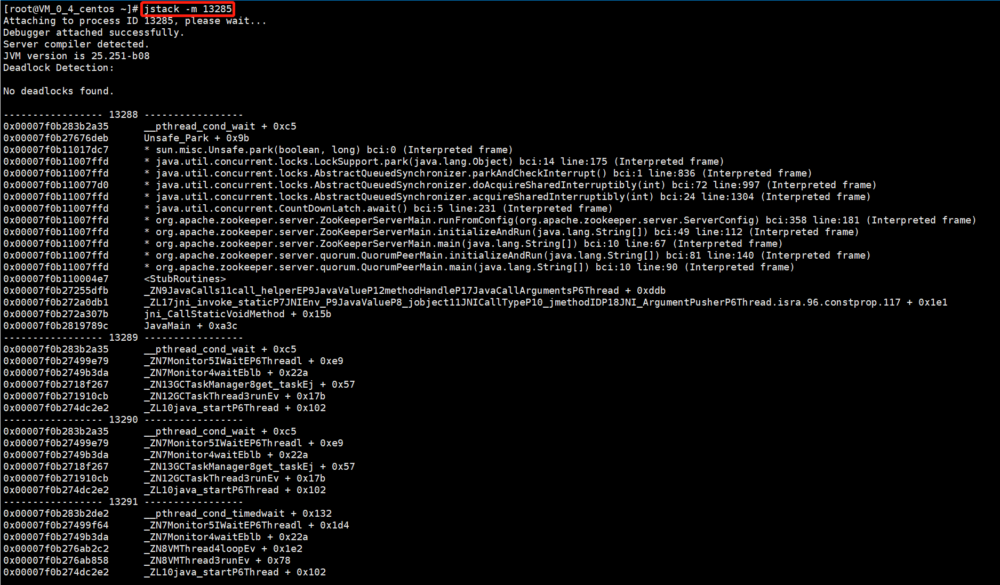

##### 命令：

1. 强制Full GC

   1. 没有开启`-XX:+DisableExplicitGC`的前提下调用`System.gc()`
   2. `jmap -histo: live pid`

2. `jps(JVM Process Status Tool)`：显示指定系统内所有的HotSpot虚拟机进程

   例如：

   1. **`jps -l`：输出主类的全名，如果进程执行的是Jar包，则输入Jar路径**
   2. `jps -m`：输出虚拟机进程启动时传递给主类main()函数的参数
   3. **`jps -v`：输出虚拟机进程启动时JVM参数**

3. `jstat(JVM Statistics Monitoring Tool)`：收集HotSpot虚拟机各方面的运行数据

   例如：每250ms查询一个进程14073的gc状态，一共查询20次

   

4. `jinfo(Configuration Info for Java)`：实时查看和调整虚拟机各项参数

5. `jmap(Memory Map for Java)`：`-dump`生成虚拟机的内存转储快照(heapdump文件)，`-finalizerinfo`查询Finalizer执行队列，`-heap`显示Java堆详细信息等

6. `jhat(JVM Heap Dump Browser)`：用于分析heapdump文件，它会建立一个HTTP/HTML服务器，让用户可以在浏览器上查看分析的结果

7. `jstack(Stack Trace for Java)`：用于生成虚拟机当前时刻的**线程快照**(threaddump或javacore文件)。线程快照是当前虚拟机内每一条线程正在执行的方法堆栈的集合，生成线程快照的主要目的是定位线程出现长时间停顿的常见原因。

   `jstack -l vmid`：除了堆栈信息外，显示关于锁的附加信息

   

   `jstack -F vmid`：正常输出的请求没有相应时，可以强制输出

   `jstack -m vmid`：如果调用到本地方法的话，可以显示C/C++的堆栈

   

8. `java -XX:+PrintFlagsFinal -version`：输出按字母排序的所有XX参数和值。配合`grep`命令可以过滤出目标参数

   

##### 参数设置：

1. `-XX:+HeapDumpOnOutOfMemoryError`：虚机在出现内存溢出异常时，Dump出当前的内存堆转储快照，以便进行后续处理
2. **堆中参数设置**
   1. `-Xms100M`：堆最小内存大小100M。默认为物理内存的1/64，当**堆中可用内存小于40%**(默认)时，堆内存开始增加，直到`-Xmx`的大小
   2. `-XX:MinHeapFreeRatio`：堆中可用内存小于多少时，堆内存开始增加
   3. `-Xmx100M`：堆最大内存大小100M。默认为物理内存的1/4，当**堆中可用内存大于70%**(默认)时，堆内存开始减小，直到`-Xms`的大小
   4. `-XX:MaxHeapFreeRatio`：堆中可用内存大于多少时，堆内存开始减少
   5. `-Xmn`：新生代(包括1个Eden和2个Survivor)大小
   6. `-XX:SurvivorRation=N`：调整Eden/Survivor的比例为N/1，默认为8:1
   7. `-XX:NewRatio=N`：新生代与老年代的比值1:N，默认为1:2
3. **栈中参数设置**
   1. 虚拟机栈：`-Xss100M`：栈内存大小100M
   2. 本地方法栈：`-Xoss100M`：本地方法栈100M
4. **方法区中参数设置**
   1. **永久代：**
      1. `-XX:PermSize`：设置**非堆**初始化大小。默认为物理内存的1/64
      2. `-XX:MaxPerSize`：设置最大**非堆**大小。默认为物理内存的1/4
   2. **元空间：**
      1. `-XX:MaxMetaspaceSize`：设置元空间最大值，默认为-1，即不限制，只受限于本地内存大小
      2. `-XX:MetaspaceSzie`：设置元空间初始空间大小，以字节(B)为单位，达到该值时就会触发GC进行类型卸载，同时收集器会对该值进行调整：如果释放了大量的空间，就适当降低该值；如果释放了很少的空间，那么在不超过`-XX:MaxMetaspaceSize`的情况下，适当提高该值
      3. `-XX:MinMetaspaceFreeRatio`：在垃圾收集后，控制最小的元空间剩余容量的百分比，可减少因为元空间不足导致的垃圾收集的频率
      4. `-XX:MaxMetaspaceFreeRatio`：在垃圾收集后，控制最大的元空间剩余容量的百分比。
5. **直接内存中参数设置**
   1. `-XX:MaxDirectMemorySize`：设置直接内存大小。如果没有设置的话，默认与Java堆最大值(-Xmx指定)一致。
6. 大对象直接进入老年代的阈值`-XX:PretenureSizeThreshold`
7. 新生代对象进入老年代年龄阈值`-XX:MaxTenuringThreshold`，默认为15

参考：

1. xms和xmx是否必须设置相等：http://kane-xie.github.io/2017/10/13/2017-10-13_xms%E5%92%8Cxmx%E6%98%AF%E5%90%A6%E5%BF%85%E9%A1%BB%E8%AE%BE%E7%BD%AE%E7%9B%B8%E7%AD%89/
