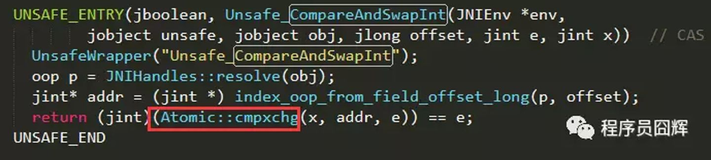
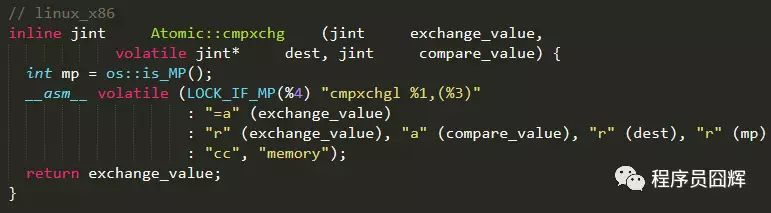
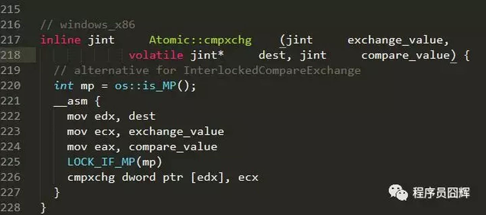

#### CAS（compare and swap）

比较后（比较内存中的旧值和预期值）交换（将内存中的旧值替换成预期值）。

CAS属于乐观锁，乐观的认为程序中的并发情况不是很严重，因此让线程不断的去尝试更新。在线程间竞争不是很激烈，同步代码段不多的时候，效率会很高。

**底层实现：**

Unsafe中对应的源码：

linux_x86的实现：

windows_x86的实现：

**Atomic::cmpxchg方法解析**：

mp是“os::is_MP()”的返回结果，“os::is_MP()”是一个内联函数，用来判断当前系统是否为多处理器。

1. 如果当前系统是多处理器，该函数返回1。
2. 否则，返回0。

**LOCK_IF_MP(mp)**会根据mp的值来决定是否为cmpxchg指令添加lock前缀。

1. 如果通过mp判断当前系统是多处理器（即mp值为1），则为cmpxchg指令添加lock前缀。
2. 否则，不加lock前缀。

这是一种优化手段，认为单处理器的环境没有必要添加lock前缀，只有在多核情况下才会添加lock前缀，因为lock会导致性能下降。cmpxchg是汇编指令，作用是比较并交换操作数。

**intel手册对lock前缀的说明如下：**

1. 确保对内存的读-改-写操作原子执行。在Pentium及Pentium之前的处理器中，带有lock前缀的指令在执行期间会锁住总线，使得其他处理器暂时无法通过总线访问内存。很显然，这会带来昂贵的开销。从Pentium 4，Intel Xeon及P6处理器开始，intel在原有总线锁的基础上做了一个很有意义的优化：如果要访问的内存区域（area of  memory）在lock前缀指令执行期间已经在处理器内部的缓存中被锁定（即包含该内存区域的缓存行当前处于独占或以修改状态），并且该内存区域被完全包含在单个缓存行（cache  line）中，那么处理器将直接执行该指令。由于在指令执行期间该缓存行会一直被锁定，其它处理器无法读/写该指令要访问的内存区域，因此能保证指令执行的原子性。这个操作过程叫做缓存锁定（cache  locking），缓存锁定将大大降低lock前缀指令的执行开销，但是当多处理器之间的竞争程度很高或者指令访问的内存地址未对齐时，仍然会锁住总线。
2. 禁止该指令与之前和之后的读和写指令重排序。
3. 把写缓冲区中的所有数据刷新到内存中。

上面的第1点保证了CAS操作是一个原子操作，第2点和第3点所具有的内存屏障效果，保证了CAS同时具有volatile读和volatile写的内存语义。

**缺点：**

+ 长时间自旋非常消耗资源

CAS的一个操作周期称为自旋，如果线程间竞争很激烈的话，那么总会很多线程处于自旋状态，直达操作成功。这个过程是非常消耗CPU资源的，应该尽量避免。

+ 只能保证一个共享变量的原子操作

当对一个共享变量进行多线程操作时，可以使用CAS的方式保证原子性，但是对于多个共享变量的操作，CAS就无法保证操作的原子性，只能用加锁的方式来保证原子性。

+ ABA的问题

通过CAS操作，变量值由A->B->A，那么从变量值上看不出其中的过程，会导致隐患。例如栈中存在A1->B1->A1，当将A1和B1弹出栈之后，和之前的栈TOP位置处的A1一样，会误认为栈内容没有变化。解决方案：给每次操作赋值一个递增值作为版本号，每次CAS时，也比较一下版本号是否一致。

Java提供了一个带有时间戳的原子引用类`AtomicStampedReference`来解决这个问题。