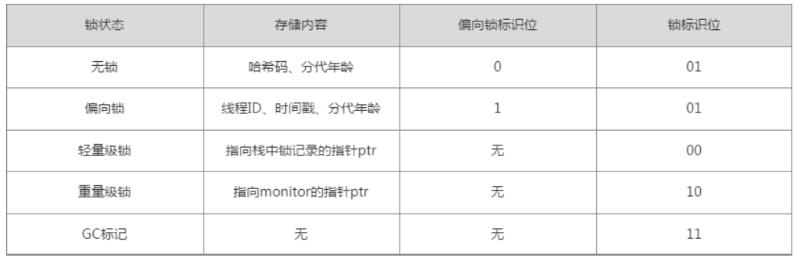

#### 1. 线程可见性

一、指令重排序-server 服务器模式会进行指令重排序-Djava.complier=NONE关闭jit优化使用jitwatch软件查看代码运行时jit指令

二、happen-before：JVM层面上对基本可见性（如：同一个线程中的前面的操作happen-before后面的操作）的定义。 定义一些禁止编译优化的场景，保证并发编程的正确性。

#### 2. synchronized原理

