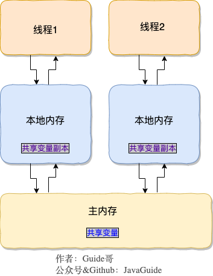
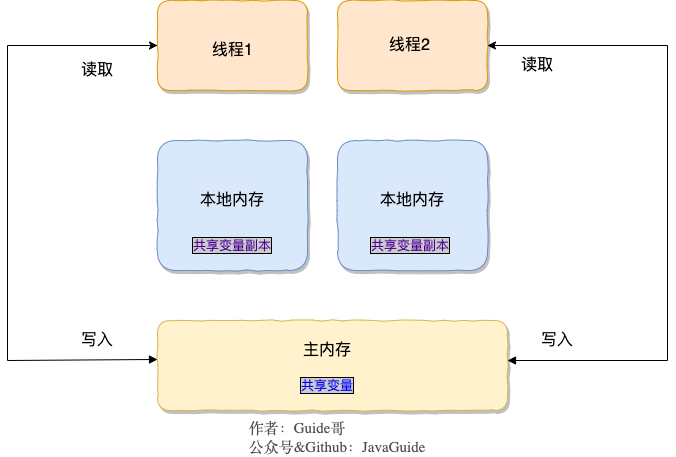
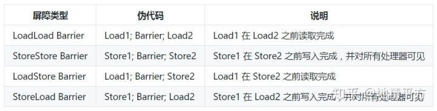

[TOC]


#### 进程与线程

1. 进程  

   一个正在运行的程序，被称为进程，是程序运行的最小单位。系统运行一个程序即是一个进程从创建，运行到消亡的过程。

2. 线程  

   线程是比进程更小的执行单位。一个进程在其执行的过程中可能会产生多个线程。

   Java中的线程的内存划分有：

   + 堆内存区：存放对象，细分为年轻代和老年代
   + 方法区：存储已被虚拟机加载的类信息，常亮，静态变量等数据

   + 程序计数器：当前程序所执行到字节码的行号

   + 本地方法栈：**为虚拟机使用到的Native方法服务**

   + 栈内存区：每个方法被执行的时候都会同时创建一个栈帧（Stack Frame）用于存储局部变量表、操作栈、动态链接、方法出口等信息。**每一个方法被调用直至执行完成的过程，就对应着一个栈帧在虚拟机栈中从入栈到出栈的过程**。会抛出**StackOverflowError** 和**OutOfMemoryError**两种异常

     

#### 并发和并行

1. 并发：同一个时间段内，宏观上看多个任务同时运行，微观上多个任务在一段时间内交替运行，在同一时间单个运行；
2. 并行：单位时间内，多个任务同时运行。


#### 创建线程的方式

1. 实现Runnable接口
2. 实现Callable接口
3. 继承Thread类

注意：

+ 实现Callable接口的线程可以返回线程执行的结果，通过Future接口接收，FutureTask是Future接口的实现类。通过调用它们的get()方法来获取到执行结果。

+ Future接口在Callable接口的实现类放到线程池时作为接收参数，FutureTask类可以直接传入到一个线程的构造函数内，例如：

  ```java
  FutureTask ft = new FutureTask(new Callable() {实现call方法})；
  Thread thread = new Thread(ft); 
  Object result =  ft.get();
  ```

+ 一个类可以同时继承Thread类并实现Runnable和Callable接口。


#### 线程的生命周期和状态

1. 线程的生命周期和状态
   + NEW：初始状态，线程被构建，但是还没有调用start()方法
   + RUNNING：运行状态
     + RUNNABLE和READY状态之间可以通过yield()方法进行调度
   + READY：就绪状态
     + READY状态的线程在获取到时间片之后就处于RUNNING状态
   + BLOCKED：阻塞状态
     + 等待进入synchronized方法/块时，线程处于BLOCKED状态
     + 获取到锁之后，进入到READY状态
   + WAITING：等待状态
     + 调用Object.wait(),Thread.join(),LockSupport.park()进入该状态
     + 调用Object.notify(),Object.notifyAll(),LockSupport.unpark(Thread)从WAITING状态回到READY状态
   + TIME_WAITING：超时等待状态
     + 调用Thread.sleep(long),Object.wait(long),Thread.join(long),LockSupport.parkNanos(),LockSupport.parkUntil()进入到该状态
     + 调用Object.notify(),Object.notifyAll(),LockSupport.unpark(Thread)从TIME_WAITING状态回到READY状态
   + TERMINATED：终止状态


#### 线程中断

1. `Thread.interrupted()`：测试当前线程是否中断，并**清除中断标记**
2. `isInterrupted()`：测试该线程是否中断，并**不会清除中断标记**
3. `interrupt()`：线程中断，标记中断标记为true。调用`sleep()、wait()、join()、park()`方法之后，线程处于waiting或timed_waiting状态时，调用该线程的`interrupt()`方法后，会报`InterruptedException`


#### 死锁

1. 什么是死锁：多个线程处于阻塞状态，它们中的一个或者多个都在等待对方的某个资源被释放。  

   例如：线程A持有资源1等待获取资源2，线程2持有资源2等待获取资源1，由于它们都想申请对方的资源，因此这两个资源就会互相等待进入死锁状态。

2. 产生死锁的条件：

   1. 互斥条件：该资源任意一个时刻只由一个线程占用。
   2. 请求与保持条件：一个进程因请求资源而阻塞时，对已获得的资源保持不放。
   3. 不剥夺条件:线程已获得的资源在未使用完之前不能被其他线程强行剥夺，只有自己使用完毕后才释放资源。
   4. 循环等待条件:若干进程之间形成一种头尾相接的循环等待资源关系。
   
3. 如何避免产生死锁

   1. **破坏互斥条件** ：这个条件我们没有办法破坏，因为我们用锁本来就是想让他们互斥的（临界资源需要互斥访问）。
   
   2. **破坏请求与保持条件**  ：一次性申请所有的资源。
   
   3. **破坏不剥夺条件** ：占用部分资源的线程进一步申请其他资源时，如果申请不到，可以主动释放它占有的资源。
   
   4. **破坏循环等待条件** ：靠按序申请资源来预防。按某一顺序申请资源，释放资源则反序释放。破坏循环等待条件。
#### sleep()和wait()方法的区别和共同点：

   1. sleep()方法不释放锁，wait()方法释放锁
   
   2. 两者都可以暂停线程的执行
   
   3. wait()通常用于线程间交互/通信，sleep()通常用于暂停执行
   
   4. wait()方法被调用后，线程不会自动苏醒（wait(long)方法超时后会自动苏醒），需要其他线程调用同一个对象的notify()或notifyAll()方法。sleep()方法执行完后，线程会自动苏醒。

#### 启动线程调用start()而不是run()

**调用 `start()` 方法方可启动线程并使线程进入就绪状态，直接执行 `run()` 方法的话不会以多线程的方式执行。**


#### 并发编程的三个特性

1. 原子性：一个操作要么全部执行完成，要么就不操作，在执行的过程中并不会受到外界的任何干扰而中断。synchronized保证代码片段的原子性。
2. 可见性：当一个线程对一个共享变量进行修改之后，另外的线程能够立即看到修改后的最新值。volatile关键字、synchronized可以保证共享变量的可见性。
3. 有序性：代码在执行的过程中的先后顺序，Java在编译器以及运行期间的优化，代码的执行顺序未必就是编写代码时候的顺序。volatile关键字可以禁止指令重排序。


#### happens-before原则

如果前一个操作(A)必须要对后一个操作(C)可见，那么这两个操作(A C)指令不能重排序。


#### Synchronized关键字

1. 作用：解决多个线程之前访问资源的同步性，synchronized关键字可以保证被它修饰的方法或代码块在任意时刻只能有一个线程执行。

   synchronized在**JDK1.6**之前属于重量级锁，效率低下。在1.6之后在**JVM层面**对synchronized有了很大的优化。JDK1.6 对锁的实现引入了大量的优化，如自旋锁、适应性自旋锁、锁消除、锁粗化、偏向锁、轻量级锁等技术来减少锁操作的开销。

2. 使用

   + 修饰实例方法
   + 修饰静态方法
   + 修饰代码块

3. synchronized底层原理
   + monitorenter指令：**同步代码块开始的位置。** 在执行monitorenter时，会尝试获取对象锁，如果锁的计数器为0，则表示锁可以被获取，获取后将锁计数器+1，即设置为1。
   + monitorexit指令：**同步代码块结束的位置。** 在执行monitorexit指令后，将锁计数器设为0，表示锁被释放。如果获取对象锁失败，那当前线程就要进入BLOCKED状态，直到对象锁被另外一个线程释放为止。
   + ACC_SYNCHRONIZED标识：**synchronized修饰的方法使用ACC_SYNCHRONIZED标识，表示该方法是一个同步方法。** JVM通过ACC_SYNCHRONIZED标识来辨别一个方法是否声明为同步方法，从而执行相应的同步调用。

4. synchronized JDK1.6之后的优化 **TODO**

#### volatile关键字

1. CPU缓存模型

   为了解决CPU处理速度和内存不匹配的问题，引入了CPU缓存技术。

2. JMM（Java内存模型）



每个线程都有自己所属的本地内存，本地内存中存有主内存的一个副本，其中存有共享变量副本。如果线程1和线程2在本地内存中都有主内存中的变量a的一个副本，并且线程1和线程2都对变量a进行的操作，那么最终写入到主内存的变量a就有可能和想要的结果不一样。（例如i++，i++操作了2次，但是最终的结果显示i++操作了1次）。

volatile关键字就是解决这个问题，被它修饰的变量，每次使用变量时都要到主存中进行读取。另外一个作用就是防止JVM的指令重排序。**volatile只保证了变量的可见性，并不能保证原子性。**



3. 禁止指令重排序的底层实现

   + 内存屏障(Memory Barrier)

     保证两个操作之间数据的可见性。

     volatile**读前插**读屏障，**写后加**写屏障，**避免CPU重排**导致的问题，实现多线程之间数据的**可见性**。

     + 写内存屏障（Store Memory Barrier）：处理器将存储缓存值**写回主存**（阻塞方式）。
+ 读内存屏障（Load Memory Barrier）：处理器，处理**失效队列**（阻塞方式）。


     
+ 具体实现
  
     将当前内核高速缓存的数据立即回写到内存，并使在其他内核里缓存了该内存地址的数据无效。
     
     MESI协议，解决缓存一致性的思路是：当CPU写数据时，如果发现操作的变量是共享变量，即在其他CPU中也存在该变量副本，那么它会发出信号通知其他CPU将该变量的缓存行设置为无效状态，当其他CPU使用这个变量时，首先会去嗅探是否有对该变量更改的信号，当发现这个变量的缓存行已经无效时，会重新从内存中读取这个变量。
     
     
#### ReentrantLock TODO


#### synchronized和volatile的区别

1. volatile保证可见性，synchronized保证可见性和原子性；volatile底层通过内存屏障防止指令重排序，变量前后之间的指令与指令之间有序课件。synchronized保证的是代码块与代码块之前的有序可见，在被synchronized修饰的方法或代码块内部，并不能防止指令重排序。
2. volatile只能修饰变量，synchronized只能修饰方法和代码块；
3. volatile不会造成线程阻塞，synchronized可能会造成线程阻塞；
4. volatile可以防止指令重排序，synchronized不能防止指令重排序。


#### synchronized和ReentrantLock的区别 TODO

1. synchronized是关键字，JVM级别的；ReentrantLock是类，在实现上比synchronized更加灵活，可以被继承，定制化开发各类方法。
2. ReentrantLock可以对获取锁的等待时间进行设置，并且可以获取锁的各种信息
3. synchronized是不可中断锁、非公平锁；ReentrantLock是可以被中断的，可以设置锁的公平性
4. ReentrantLock需要手动释放，通常在finally中进行手动释放。


#### ThreadLocal

1. ThreadLocal使用场景：

   1. 线程内的局部变量：如数据库的连接，session等
   2. 解决线程安全的问题：如`SimpleDateFormat`不是线程安全的，放到ThreadLocal中之后，就可以让每个线程内部拥有自身的`SimpleDateFormat`实例。JDK8中的`DateTimerFormatter`是线程安全的。

2. 内存泄露的问题

   `ThreadLocal`作为`ThreadLocalMap`中的Key值，是一个弱引用`WeakReference`。在内存不足发生GC时，会被垃圾收集器回收掉，这样就导致再也访问不到以这个`ThreadLocal`为Key的Value值。

   `get()，set()，remove()`方法都会清除key为null的Entry。

   ```java
   // 获取到线程t的threadLocals变量
   ThreadLocalMap getMap(Thread t) {
       return t.threadLocals;
   }
   
   // 获取当前线程的ThreadLocalMap
   // 如果map存在，则将当前的threadLocal实例和value值设置到ThreadLocalMap中
   // 如果map不存在，则生成一个新的ThreadLocalMap
   public void set(T value) {
       Thread t = Thread.currentThread();
       ThreadLocalMap map = getMap(t);
       if (map != null)
           map.set(this, value);
       else
           createMap(t, value);
   }
   
   public T get() {
       Thread t = Thread.currentThread();
       ThreadLocalMap map = getMap(t);
       if (map != null) {
           ThreadLocalMap.Entry e = map.getEntry(this);
           if (e != null) {
               @SuppressWarnings("unchecked")
               T result = (T)e.value;
               return result;
           }
       }
       return setInitialValue();
   }
   
   public void remove() {
       ThreadLocalMap m = getMap(Thread.currentThread());
       if (m != null)
           m.remove(this);
   }
   
   // 创建一个新的ThreadLocalMap
   void createMap(Thread t, T firstValue) {
       t.threadLocals = new ThreadLocalMap(this, firstValue);
   }
   ```

   ```java
   // ThreadLocalMap的构造器
   ThreadLocalMap(ThreadLocal<?> firstKey, Object firstValue) {
       table = new Entry[INITIAL_CAPACITY];
       int i = firstKey.threadLocalHashCode & (INITIAL_CAPACITY - 1);
       table[i] = new Entry(firstKey, firstValue);
       size = 1;
       setThreshold(INITIAL_CAPACITY);
   }
   
   // Entry类的结构，继承自弱引用
   static class Entry extends WeakReference<ThreadLocal<?>> {
       /** The value associated with this ThreadLocal. */
       Object value;
   
       Entry(ThreadLocal<?> k, Object v) {
           super(k);
           value = v;
       }
   }
   
   // ThreadLocalMap的set方法
   private void set(ThreadLocal<?> key, Object value) {
   
       // We don't use a fast path as with get() because it is at
       // least as common to use set() to create new entries as
       // it is to replace existing ones, in which case, a fast
       // path would fail more often than not.
   
       Entry[] tab = table;
       int len = tab.length;
       int i = key.threadLocalHashCode & (len-1);
   
       for (Entry e = tab[i];
            e != null;
            e = tab[i = nextIndex(i, len)]) {
           ThreadLocal<?> k = e.get();
   
           if (k == key) {
               e.value = value;
               return;
           }
   
           if (k == null) {
               replaceStaleEntry(key, value, i);
               return;
           }
       }
   
       tab[i] = new Entry(key, value);
       int sz = ++size;
       if (!cleanSomeSlots(i, sz) && sz >= threshold)
           rehash();
   }
   ```


参考：

1. Java非阻塞异步编程——CompletableFuture：https://blog.csdn.net/qq_36403693/article/details/105430351?utm_medium=distribute.pc_relevant.none-task-blog-baidujs_title-0&spm=1001.2101.3001.4242
2. Java并发包之阶段执行之CompletionStage接口：https://www.cnblogs.com/txmfz/p/11266411.html