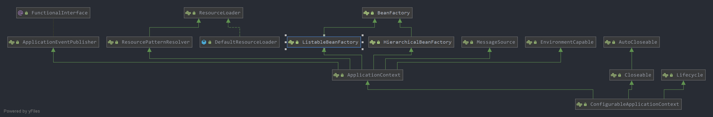

1. ApplicationContext和BeanFactory的区别
   + BeanFactory是一个功能比较简单的容器
   + ApplicationContext在其基础上扩展了很多的功能，如
     + MessageSource，提供国际化的消息访问
     + 资源访问，如URL和文件
     + 事件传播
     + 载入多个（有继承关系）上下文，使得每一个上下文都专注于一个特定的层次，比如应用的Web层
   
2. BeanWrapper
   
3. BeanNameAware、BeanFactoryAware、BeanClassLoaderAware和ApplicationContextAware的作用

    Aware，知道的，已感觉的，让bean能够感知到spring的存在，获取到自身在spring中的属性。

    + BeanNameAware：可以知道beanName
    + BeanFactoryAware：可以知道beanFactory
    + BeanClassLoaderAware：可以知道BeanClassLoader
    + ApplicationContextAware：可以知道ApplicationContext

    ```java
    public class MyBean implements BeanNameAware, BeanFactoryAware {
    
        private BeanFactory beanFactory;
    
        private String beanName;
    
        @Override
        public void setBeanFactory(BeanFactory beanFactory) throws BeansException {
            this.beanFactory = beanFactory;
        }
    
        @Override
        public void setBeanName(String s) {
            this.beanName = s;
        }
    
        @Override
        public String toString() {
            return "MyBean{" +
                    "beanFactory=" + beanFactory +
                    ", beanName='" + beanName + '\'' +
                    '}';
        }
    }
    ```

4. EntityResolver的用法
    SAX应用程序在解析XML文件时，需要先读取该XML文件上的声明，根据声明去寻找对应的DTD定义，以便对文档进行验证。  
    默认寻找规则是通过网络来下载对应的DTD声明，并进行认证。 
    EntityResolver的作用是项目本身就可以提供一个如何寻找DTD声明的方法。比如将DTD文件方法项目的某处，在实现时直接将该文档读取并返回给SAX即可。这样就避免了通过网络来寻找相应的声明。  

5. BeanDefinition：描述了一个bean的实例，包括属性值，构造方法参数类型、参数值，继承自它的类，scope作用域等信息。

    配置文件\<bean>元素标签在spring容器内部的表现形式。\<bean>元素标签拥有class、scope、lazy-init等属性，BeanDefinition则提供了相对应的beanClass、scope、lazyInit属性，BeanDefinition和\<bean>中的属性是一一对应的。

    + AbstractBeanDefinition：定义了描述bean的属性，如是否是抽象类、是否单例、depends-on属性、工厂方法名、工厂类名、init函数名、destory函数名、构造函数形参值、被IOC容器覆盖的方法、bean的属性以及对应的值等。通过这个类，可以看到bean的默认配置

    + GenericBeanDefinition：通用的bean definition，继承自AbstractBeanDefinition，在其基础上添加了通过parentName属性来灵活设置parent bean definition。XML配置文件最初被加载进来就是GenericBeanDefinition

    + RootBeanDefinition：继承自AbstractBeanDefinition，在其基础上定义了很多属性，初始化bean所需要的信息基本上都有，如：

      + 定义了id、别名与bean的对应关系
      + Bean的注解
      + 具体的工厂方法，包括工厂方法的返回类型，工厂方法的Method对象
      + 构造函数、构造函数形参
      + Bean的class对象

    + ChildBeanDefinition：继承它父类的设置，对RootBeanDefinition有一定的依赖关系

    + AnnotatedBeanDefinition：注解类型的bean definition

    + ScannedGenericBeanDefinition：实现`AnnotatedBeanDefinition`类，继承自`GenericBeanDefinition`。存储@Compont、@Service、@Controller等注解配置类。

      ```java
      // 存储扫描进来的Bean的一些注解信息
      private final AnnotationMetadata metadata;
      ```

    + AnnotatedGenericBeanDefinition：实现`AnnotatedBeanDefinition`类，继承自`GenericBeanDefinition`。在注解驱动的spring应用中使用非常多，获取注解信息非常方便

      ```java
      private final AnnotationMetadata metadata;
      private MethodMetadata factoryMethodMetadata;
      ```

    + ConfigurationClassBeanDefinition：`ConfigurationClassBeanDefinitionReader`中的内部私有静态类(`private static class ConfigurationClassBeanDefinition extends RootBeanDefinition implements AnnotatedBeanDefinition`)，负责将@Bean注解的方法转换为对应的`ConfigurationClassBeanDefintion`类。Spring初始化时，使用该类存储用户自定义的bean

6. Map<String, RootBeanDefinition> mergedBeanDefinitions

7. Set<String> alreadyCreated

8. BeanFactory、ObjectFactory和FactoryBean的区别
    + BeanFactory是一个Factory，IOC容器或对象工厂。在Spring中，所有的Bean都是有BeanFactory（也就是IOC容器）进行管理的。负责对bean的创建、访问等工作。
    + FactoryBean是个bean，一个能生产或修饰对象生成的工厂bean。实现了FactoryBean<T>接口的Bean，根据该Bean的Id从BeanFactory获取的实际上是FactoryBean的getObject()返回的对象，而不是FactoryBean本身，如果想要获取FactoryBean对象，需要在Id前加&符号来获取。
    + ObjectFactory是一个普通的对象工厂接口。和不同的作用域有关。

9. BeanPostProcessor用法：bean后置处理器

    ```java
    public class MyBeanPostProcessor implements BeanPostProcessor {
    
        // 初始化之前执行
        public Object postProcessBeforeInitialization(Object bean, String beanName) throws BeansException {
            System.out.println("初始化之前执行...");
            if (bean instanceof MyBean) {
                ((MyBean) bean).setBeanName("初始化之前的beanName");
            }
            return bean;
        }
    
        // 初始化之后执行
        public Object postProcessAfterInitialization(Object bean, String beanName) throws BeansException {
            System.out.println("初始化之后执行...");
            if (bean instanceof MyBean) {
                ((MyBean) bean).setBeanName("初始化之后的beanName");
            }
            return bean;
        }
    }
    ```

10. BeanFactoryPostProcessor用法：bean工厂后置处理器，比BeanPostProcessor功能更加强大，可以获取bean的定义，修改bean的属性等，但是使用不当会造成spring容器的损害，**例如绝对不能在BeanFactoryPostProcessor中触发bean的实例化。**

    允许我们在工厂里所有的bean被加载进来后但是还没有初始化前，对所有bean的属性进行修改，也可以添加属性。

    ```java
    public class MyBeanFactoryPostProcessor implements BeanFactoryPostProcessor {
        @Override
        public void postProcessBeanFactory(ConfigurableListableBeanFactory configurableListableBeanFactory) throws BeansException {
            MyBean xxx = (MyBean) configurableListableBeanFactory.getBean("xxx");
            xxx.setBeanName("yyy");
        }
    }
    ```

11. InitializingBean接口用法：为bean提供了属性初始化后的处理方法，凡是实现该接口的类，在bean属性初始化完成后都会执行该方法。

     ```java
     // MyBean是自己定义的一个类，其中有个属性为beanName
     public class MyInitializingBean extends MyBean implements InitializingBean {
     
         @Override
         public void afterPropertiesSet() throws Exception {
             System.out.println("Initializing...");
             this.setBeanName("initializing myBean...");
         }
     }
     ```

12. DisposableBean接口用法：使用同InitializingBean，提供`destroy()`方法，在容器销毁时调用

13. init-method、destory-method：

     指定组建init和destory的方法：

     1. 在配置类中，使用`@Bean(initMethod="init", destroyMethod="destroy")`注解指定
     2. 实现`InitializingBean`接口重写`afterPropertiesSet`方法，实现`DisposableBean`接口重写`destroy`方法
     3. 利用java的JSR250规范中的`@PostConstruct`标注在init方法上，`@PreDestroy`标注在destroy方法上

14. 构造器、@PostConstruct、init-method、InitializingBean和BeanPostProcessor等的执行顺序

     1. 初始化过程：构造器 > BeanPostProcessor中的postProcessBeforeInitalization方法 > @PostConstruct > InitializingBean afterPropertiesSet方法> init-method > BeanPostProcessor中的postProcessAfterInitalization方法

         **如果一个类同时实现了InitializingBean和BeanPostProcessor接口的话，BeanPostProcessor中的方法会在init-method方法之后执行。但是一般不会这样设置，BeanPostProcessor的实现类作用于全局，而InitializingBean的实现类只作用于实现类**

     2. 销毁过程：@PreDestroy >  DisposableBean destory()方法 > destroy-method

15. spring事件监听机制

      1. 观察者模式

      2. ApplicationEvent事件

      3. ApplicationListener事件监听器

      4. ApplicationEventMulticaster事件发布器。`ApplicationContext`接口继承了`ApplicationEventPublisher`事件发布器，而`AbstractApplicationContext`抽象类实现了`ConfigurableApplicationContext`接口，该接口继承了`ApplicationContext`接口，在发布事件的实现方法`void publicshEvent(Object obj)`中，其实是委托`ApplicationEventMulticaster`类来实现事件的发布。

          
          
          ```java
          // AbstractApplicationContext.java
          @Override
          public void publishEvent(ApplicationEvent event) {
             publishEvent(event, null);
          }
          
          /**
           * Publish the given event to all listeners.
           * <p>Note: Listeners get initialized after the MessageSource, to be able
           * to access it within listener implementations. Thus, MessageSource
           * implementations cannot publish events.
           * @param event the event to publish (may be an {@link ApplicationEvent}
           * or a payload object to be turned into a {@link PayloadApplicationEvent})
           */
          @Override
          public void publishEvent(Object event) {
             publishEvent(event, null);
          }
          
          /**
           * Publish the given event to all listeners.
           * @param event the event to publish (may be an {@link ApplicationEvent}
           * or a payload object to be turned into a {@link PayloadApplicationEvent})
           * @param eventType the resolved event type, if known
           * @since 4.2
           */
          protected void publishEvent(Object event, @Nullable ResolvableType eventType) {
             Assert.notNull(event, "Event must not be null");
             if (logger.isTraceEnabled()) {
                logger.trace("Publishing event in " + getDisplayName() + ": " + event);
             }
          
             // Decorate event as an ApplicationEvent if necessary
             ApplicationEvent applicationEvent;
             if (event instanceof ApplicationEvent) {
                applicationEvent = (ApplicationEvent) event;
             }
             else {
                applicationEvent = new PayloadApplicationEvent<>(this, event);
                if (eventType == null) {
                   eventType = ((PayloadApplicationEvent<?>) applicationEvent).getResolvableType();
                }
             }
          
             // Multicast right now if possible - or lazily once the multicaster is initialized
             if (this.earlyApplicationEvents != null) {
                this.earlyApplicationEvents.add(applicationEvent);
             }
             else {
                // 获取ApplicationEventMulticaster
                // 调用其void multicastEvent(ApplicationEvent event, @Nullable ResolvableType eventType);方法
                getApplicationEventMulticaster().multicastEvent(applicationEvent, eventType);
             }
          
             // Publish event via parent context as well...
             if (this.parent != null) {
                if (this.parent instanceof AbstractApplicationContext) {
                   ((AbstractApplicationContext) this.parent).publishEvent(event, eventType);
                }
                else {
                   this.parent.publishEvent(event);
                }
             }
          }
          ```

16. Interceptor用法：只能拦截Controller方法，实现`HandleIntercepter`接口

      ```java
      public interface HandlerInterceptor {
          default boolean preHandle(HttpServletRequest request, HttpServletResponse response, Object handler)
                throws Exception {
      
             return true;
          }
          default void postHandle(HttpServletRequest request, HttpServletResponse response, Object handler,
                      @Nullable ModelAndView modelAndView) throws Exception {
              }
          default void afterCompletion(HttpServletRequest request, HttpServletResponse response, Object handler,
                      @Nullable Exception ex) throws Exception {
              }
      }
      ```

17. @Transactional注解（基于注解的声明式事务）

     1. 正确设置@Transactional的**propagation**属性：需要注意下面三种propagation可以不启动事务。本来期望目标方法进行事务管理，但是若错误的配置这三种propagation，事务将不会发生回滚。

        1. **TransactionalDefinition.PROPAGATION_SUPPORTS**:如果当前存在事务，则加入该事务；如果当前没有事务，则以非事务的方式继续运行
        2. **Transactional.PROPAGATION_NOT_SUPPORT**:以非事务方式运行，如果当前存在事务，则把当前事务挂起
        3. **Transactional.PROPAGATION_NEVER**:以非事务方式运行，如果当前存在事务，则抛出异常

     2. 正确设置@Transactional的**rollbackFor**属性：默认情况下，如果在事务中抛出了**RuntimeException**或者**Error则Spring将回滚事务**；除此之外，Spring不会回滚事务。如果在事务中抛出其他类型的异常，并期望Spring能够回滚事务，可以**指定rollbackFor**。但是如果异常被try...catch处理了，则事务不会回滚。

     3. @Transactional只能应用到public方法才会生效： 这是因为在使用 Spring AOP 代理时，Spring 在调用在 TransactionInterceptor  在目标方法执行前后进行拦截之前，DynamicAdvisedInterceptor（CglibAopProxy 的内部类）的  intercept 方法或 JdkDynamicAopProxy 的 invoke 方法会间接调用  **AbstractFallbackTransactionAttributeSource**（Spring 通过这个类获取@Transactional 注解的事务属性配置属性信息）的 **computeTransactionAttribute** 方法。 

        ```java
        // AbstractFallbackTransactionAttributeSource
        protected TransactionAttribute computeTransactionAttribute(Method method,
            Class<?> targetClass) {
                // Don't allow no-public methods as required.
                if (allowPublicMethodsOnly() && !Modifier.isPublic(method.getModifiers())) {
                    return null;
                }
        ```
        
     4. 避免Spring的AOP的自调用问题：若同一个类中的其他**没有@Transactional注解的方法**``内部调用``了**有@Transactional注解的方法**，**有@Transactional注解的方法的事务被忽略，不会发生回滚**。这个是由于Spring AOP造成的。为了解决这个问题，可以使用AspectJ取代Spring AOP：

        1. 将AspectJ信息添加到xml配置文件

        ```xml
        
        <tx:annotation-driven mode="aspectj" />
        <bean id="transactionManager"
        class="org.springframework.jdbc.datasource.DataSourceTransactionManager">
        <property name="dataSource" ref="dataSource" />
        </bean>
        </bean
        class="org.springframework.transaction.aspectj.AnnotationTransactionAspect"
        factory-method="aspectOf">
        <property name="transactionManager" ref="transactionManager" />
        </bean>
        
        ```

        2. 在pom文件中添加相关的依赖
        
     5. 事务传播行为

        1. PROPAGATION_QEQUIRED：如果当前没有事务，则新建一个事务，如果存在一个事务，则加入到这个事务中
           1. 外围方法开启事务的情况下`Propagation.REQUIRED`修饰的内部方法会加入到外围方法的事务中，所有`Propagation.REQUIRED`修饰的内部方法和外围方法均属于同一事务，只要一个方法回滚，整个事务均回滚。调用的方法内部只要出现了异常，不管有没有try...catch事务都会发生回滚
           2. 外围方法未加事务，则被PROPAGATION_QEQUIRED修饰的方法会开启自己的事务，且开启的事务相互独立，互不干扰。
        2. PROPAGATION_SUPPORTS：支持当前事务，如果当前没有事务，就以非事务方式执行
        3. PROPAGATION_MANDATORY：使用当前的事务，如果当前没有事务，则抛出异常
        4. PROPAGATION_REQUIRES_NEW：新建事务，如果当前存在事务，则把当前事务挂起
           1. 外围方法未加事务，则被PROPAGATION_REQUIRES_NEW修饰的方法会开启自己的事务，且开启的事务相互独立，互不干扰
           2. 在外围方法开启事务的情况下`Propagation.REQUIRES_NEW`修饰的内部方法依然会单独开启独立事务，且与外部方法事务也独立，内部方法之间、内部方法和外部方法事务均相互独立，互不干扰。
        5. PROPAGATION_NOT_SUPPORTED：以非事务方式执行操作，如果当前存在事务，就把当前事务挂起
        6. PROPAGATION_NEVER：以非事务方式执行，如果当前存在事务，则抛出异常
        7. PROPAGATION_NESTED：如果当前存在事务，则在嵌套事务内执行。如果当前没有事务，则执行与PROPAGATION_REQUIRED类似的操作
           1. 外围方法未开启事务的情况下`Propagation.NESTED`和`Propagation.REQUIRED`作用相同，修饰的内部方法都会新开启自己的事务，且开启的事务相互独立，互不干扰
           2. 外围方法开启事务的情况下`Propagation.NESTED`修饰的内部方法属于外部事务的子事务，外围主事务回滚，子事务一定回滚，而内部子事务可以单独回滚而不影响外围主事务和其他子事务
        
    6. spring事务中的隔离级别
    
        1. TransactionDefinition.ISOLATION_DEFAULT，使用后端数据库默认的事务隔离级别
        2. TransactionDefinition.ISOLATION_READ_UNCOMMITTED，读未提交，会导致脏读、幻读和不可重复读
        3. TransactionDefinition.ISOLATION_READ_COMMITTED，读已提交，会导致幻读和不可重复读
        4. TransactionDefinition.ISOLATION_REPEATABLE_READ，重复读，会导致幻读
        5. TransactionDefinition.ISOLATION_SERIALIZABLE，序列化，可解决一切事务并发问题
    
18. Spring中bean的作用域

     1. singleton：单例模式，也是spring容器中默认的作用域
     2. prototype：原型模式，每次获取bean时都会生成一个新的对象
     3. request：每次HTTP请求都会生成一个新的bean，该bean仅在当前request内有效
     4. session：每次HTTP请求都会生成一个新的bean，该bean仅在当前session内有效
     5. global session：全局session作用域，仅在基于portlet的web应用才有意义，在spring5之后就不存在了（因为web模块中的portlet组件已经被废弃了）

19. Spring中bean的生命周期


参考：

1. 使用BeanFactoryPostProcessor——这种姿势不要用：https://www.jianshu.com/p/3d099ea43b0e
2. 【小家Spring】Spring IoC容器中核心定义之------BeanDefinition深入分析（RootBeanDefinition、ChildBeanDefinition...）：https://fangshixiang.blog.csdn.net/article/details/88683596?utm_medium=distribute.pc_relevant.none-task-blog-2%7Edefault%7EBlogCommendFromMachineLearnPai2%7Edefault-4.control&dist_request_id=1328767.10518.16173394390438211&depth_1-utm_source=distribute.pc_relevant.none-task-blog-2%7Edefault%7EBlogCommendFromMachineLearnPai2%7Edefault-4.control

