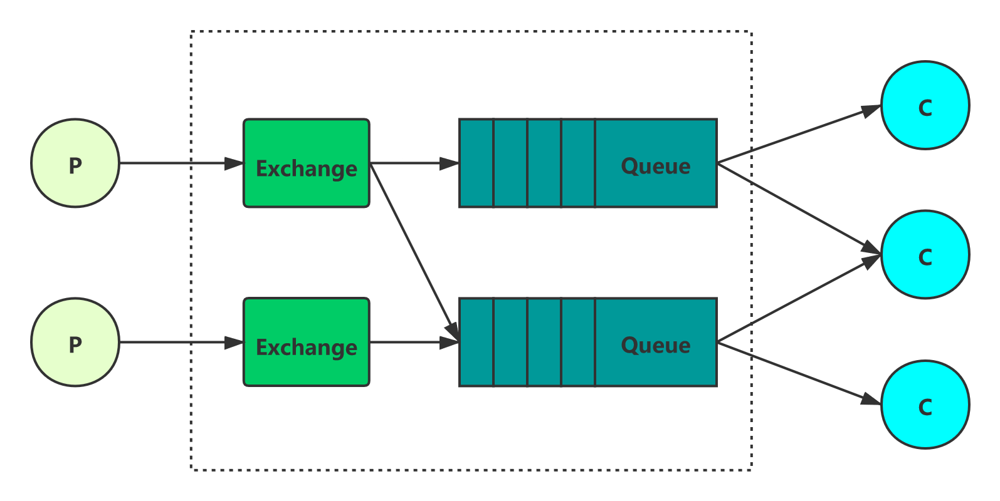
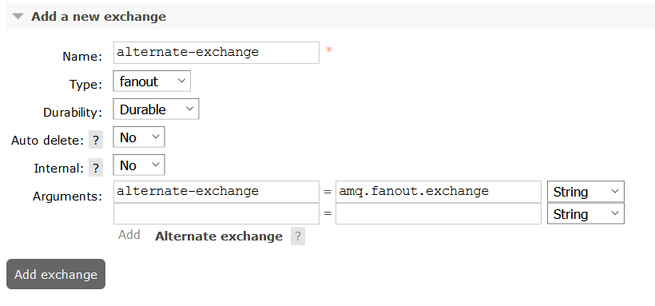

1. 消息通信出现的背景：当下互联网行业中的各种分布式和服务化系统的开发本质上就是解决一个问题，即**系统如何进行拆分和集成。**服务拆分需要用到**面向领域思想**，而服务集成则可以采用RPC、REST、消息通信等多种技术体系。

2. 消息中间件：是一种软件或硬件基础设施，通过它可以在分布式系统中发送和接收消息。

3. RPC:
   1.   

4. RabbitMQ和Erlang：
   1. Erlang是一种面向电信行业的函数式编程语言，被设计成一种分布式、高容错的软实时系统，用于构建99.999%可用性的应用系统。作为一种开发语言和运行时系统，Erlang专注于节点之间消息通信的轻量级进程，提供了状态无关的高并发性。
   2. Erlang的分布式通信架构天然可以用于构建RabbitMQ集群机制。RabbitMQ集群中的服务器充分利用Erlang的进程间通信(Inter-Process Communication,IPC)系统，具备其他竞品消息代理服务器不得不去实现的集群功能。

5. AMQP规范：主要由两份文档组成，一份是描述AMQ模型和AMQ协议的高层次文档；另一份则提供了每个类、方法、属性和字段的多层次的详细信息。
   1. 高级消息队列(Advanced Message Queuing, AMQ)模型在逻辑上定义的三种抽象组件
      + 交换器(Exchange)，消息代理服务器中用于把消息路由到队列的组件
      + 队列(Queue)，用于存储消息的数据结构，位于硬件或内存中
      + 绑定(Binding)，一套规则，用于告诉交换器消息应该被存储到哪个队列
   2. AMQ协议

6. RabbitMQ在支持AMQP的同时，也支持了MQTT、Stomp、XMPP等协议

7. 使用消息队列的场景

   1. 异步

      虽然也可以使用线程池解决异步的问题，但是整体耦合度过高，修改一部分代码，导致整个项目都要重新打包发布，重新测试。而使用消息队列之后，部分不太重要的功能就可以解耦为另外的模块，这样不会导致重要功能出问题，同时也会提高整体功能的响应。

   2. 削峰

      把请求放到消息队列中，消息队列中消息的多少根据自己服务器的处理能力来设置。这样当大量请求到来时，不至于将服务器压垮。

   3. 解耦

      将某个需求按照优先级进行划分，部分不是那么重要的功能可以单独的划分出一个模块，通过消息队列进行连接，这样保证了需求接口的响应时间。

8. 使用消息队列会随着带来什么问题

   1. 系统复杂性

      加入一个新的中间件势必会增加整个系统的复杂性，需要考虑消息队列在使用过程中出现的各种问题。

   2. 数据一致性

      在同一个需求中，部分功能单独成为模块，在调用需求接口时，需要保证每个功能模块的数据一致性。涉及到分布式事务。

   3. 可用性

      需要保证消息队列的高可用性。

9. 重复消费

   当某个模块处理某个消息出现异常时，会让消息队列重新发送该消息，这样与消息队列连接的其他的模块也会重复的接收到消息，如果不进行处理，则会导致消息的重复消息。一般都会使用某个业务上的唯一的参数与消息进行绑定，在处理消息之前，先判断该消息是否已经处理过，只有在没有处理的情况下，才会对该消息进行处理。

10. 顺序消费

    使用场景为业务上需要消息顺序的进行处理，比如使用binlog进行数据库数据的迁移，在对一个数据进行增改删操作时，在迁移时也要保证操作顺序是增改删的。

11. 避免消息丢失

    

    + 消息生产方生产消息到RabbitMq Server时保证消息可靠
      + 保证消息准确被Exchange接收，并发送到相应的Queue

        1. AMQP协议提供的事务机制：这种是同步操作，一条消息发送之后会使发送端阻塞，以等待RabbitMq Server的响应，之后才能继续发送下一条消息，生产者生产消息的吞吐量和性能会大大降低

           1. channel.txSelect开启一个事务
           2. channel.txCommit提交事务
           3. channel.txRollback回滚事务

        2. 发送方确认机制(publisher confirm)

           1. 生产者调用`channel.confirmSelect`方法**将信道设置为confirm模式**，一旦信道进入confirm模式，**所有在该信道上面发布的消息都会被指派一个唯一的Id(从1开始)，一旦消息被投递到所有匹配的队列之后，RabbitMq就会发送一个确认(Basic.Ack)给生产者(包含消息的唯一deliveryTag和multiple参数，deliverTag中包含确认消息的序号，当multiple为true时，表示deliverTag序号之前的消息都得到了处理)**，这时生产者就知道消息已经正确到达Exchange了

           2. confirm实现的方式

              1. 串行confirm模式：发送一条消息后，调用waitForConfirm()方法，等待broker端confirm，如果broker返回false或在超时时间内没有返回，则生产者进行消息重传
              2. 批量confirm模式：生产者每发送一批消息后，调用waitForConfirm()方法，等待broker端confirm。**该方式有一个很大的缺陷，当一批消息中出现一个错误后，会导致这一批消息都没有确认，最终导致性能下降**
              3. 异步confirm模式：**提供一个回调方法**，broker端confirm了一条或者多条消息后生产端会回调这个方法

           3. 异步confirm模式

              1. 在channel上添加一个`ConfirmListener`，当消息被broker端接收后，就会调用相应的方法

                 ```java
                 public interface ConfirmListener {
                     /**
                     * RabbitMq消息接收成功的方法，成功后业务上可以做的事情
                     * 生产者投递消息之前，需要先把消息存放起来，接收到ACK之后再删除
                     **/
                     void handleAck(long deliveryTag, boolean multiple)
                         throws IOException;
                 
                     /**
                     * RabbitMq消息接收失败的方法，用户可以在这里重新投递消息
                     **/
                     void handleNack(long deliveryTag, boolean multiple)
                         throws IOException;
                 }
                 ```

      + 当消息发送到Exchange后，没有对应的消费者，此时消息也将丢失

        1. 将mandatory设置为true，channel上需要添加一个`ReturnListener`

           ```java
           /**
           * 当mandatory设置为true时，如果exchange根据自身的类型和消息的routeKey无法找到一个符合条件的queue，那么会调用basic.return方法
           * 将消息返回给生产者；如果设置为false时，出现上述情况时，broker会直接将消息丢弃。
           * 
           * 当immediate设置为true时，如果exchange无法找到符合条件的queue时，那么这条消息不会放到队列中；
           * 如果设置为false时，出现上述情况，broker会通过basic.return将消息返给生产者。
           *
           **/
           void basicPublish(String exchange, String routingKey, boolean mandatory, boolean immediate, BasicProperties props, byte[] body)
                   throws IOException;
           ```

           ```java
           /**
           * 没有找到符合条件的queue的消息，会被ReturnListener监听，并执行该方法
           **/
           public interface ReturnListener {
               void handleReturn(int replyCode,
                       String replyText,
                       String exchange,
                       String routingKey,
                       AMQP.BasicProperties properties,
                       byte[] body)
                   throws IOException;
           }
           ```

        2. 利用备份交换机(alternate-exchange)，实现没有路由到队列的消息

           

           在web-ui中设置一个alternate-exchange，消息没有消费者时，会自动转移到alternate-exchange对应的queue，保证消息不会丢失。

        3. **当alternate-exchange和mandatory一起使用时，mandatory参数无效**

    + RabbitMq Server中存储消息保证可靠

    + RabbitMq Server发送消息到消费者保证消息可靠