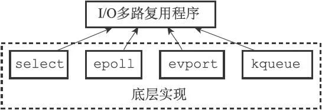

1. **Redis的基本数据类型**

   | 类型     | 简介 | 特性 | 场景 | 命令 |
   | :------ | ----------- | ----------- | ----------- | ------- |
   | String(字符串) | 二进制安全 | 可以包含任何数据，比如jpg图片或者序列化的对象，String类型的值最大能存储512MB |      | set、get、incr、incrby |
   | Hash(字典) | 键值对(Key->Value)集合，是一个String类型的值和kv键值对的映射表 | 特别适合存储对象，并且可以像数据库中update一个属性一样只修改某一项属性值。每个hash可以存储2^32-1个键值对 | 存储、读取、修改 | hmset、hmget、hset、hget、hlen、hkeys、hdel |
   | List(列表) | 链表(双向而非循环链表) | 按照插入的顺序排序，可以添加一个元素到列表的头部(左边)或者尾部(右边) | 1. 最新消息排列 2. 消息队列 | lpush、rpush、lpop、rpop、rpoplpush、brpoplpush、lrem、blpop |
   | Set(集合) | Hash表实现，元素不重复 | 1. 通过Hash表实现，添加，删除，查找的时间复杂度都是O(1) 2. 为集合提供了求交集、并集、差集等操作 | 1. 共同好友  2. 好友推荐 | sadd、sdiff(差集)、smembers、sinter(交集)、sunion(并集)、spop、srem |
   | Sorted Set(有序集合) | 将Set中的元素增加一个权重参数score，元素按score有序排列 | 数据插入集合时，已经进行天然排序 | 1.排行榜 2. 带权重的消息队列 | zadd、zrem、zrange、zincrby、zrank、zscore、zunionstore、zinterstore |
   
2. 事件：Redis服务器是一个**事件驱动**程序。

   

   需要处理以下两类事件：

   + **文件事件**：Redis服务器通过**套接字**与客户端(或其他Redis服务器)进行连接，而**文件事件就是服务器对套接字操作的抽象**。服务器与客户端(或者其他服务器)的**通信会产生相应的文件事件**，而**服务器则通过监听并处理这些事件来完成一系列网络通信的操作**。

     + Redis基于**Reactor模式**开发了自己的网络事件处理器：这个处理器被称为**文件事件处理器(file event handler)**

       1. 文件事件处理器使用**I/O多路复用(multiplexing)程序**来同时监听多个套接字，并根据套接字目前执行的任务来为套接字关联不同的事件处理器

            

       2. **当被监听的套接字准备好执行连接应答(accept)、读取(read)、写入(write)、关闭(close)等操作时，与操作相对应的文件事件就会产生**，这时文件事件处理器就会**调用套接字之前关联好的事件处理器**来处理这些事件

     + 文件事件处理器的构成：套接字、I/O多路复用程序、文件事件分派器(dispatcher)、事件处理器

     

     + I/O多路复用程序中的队列：I/O多路复用程序会将**所有产生事件的套接字都放到一个队列**里面，然后通过这个队列，**以有序(sequentially)、同步(synchronously)、每次一个套接字**的方式**向文件事件分派器传送套接字**。当**上一个套接字产生的事件被处理完毕之后**(该套接字为事件所关联的事件处理器执行完毕)，**I/O多路复用程序才会继续向文件事件分派器传送下一个套接字**。

     

   + **时间事件**：Redis服务器中的一些操作(比如**serverCron函数**)需要在给定的时间点执行，而时间事件就是服务器对这类定时操作的抽象。

     + 时间事件分类
       1. 定时事件：让程序在指定的时间之后执行一次
       2. **周期性事件**：让程序每隔指定时间就执行一次（**目前Redis只支持这类时间事件**）
     + 时间事件属性
       1. id：服务器为时间事件创建的全局唯一ID(标识号)。ID号按照从小到大的顺序递增，新事件的ID号比旧事件的ID号要大
       2. when：毫秒精度的UNIX时间戳，记录了时间事件的到达(arrive)时间
       3. timeProc：时间事件处理器，一个函数。当时间事件到达时，服务器就会调用相应的处理器来处理事件
     + 时间事件是定时事件还是周期性事件取决于时间事件处理器的返回值
        1. 如果事件处理器返回ae.h/AE_NOMORE，那么这个事件为定时事件：该事件在达到一次之后就会被删除，之后不再到达
        2. 如果事件处理器返回一个非AE_NOMORE的整数值，那么这个事件为周期性时间：当一个时间事件到达之后，服务器会根据事件处理器返回的值，对时间事件的when属性进行更新，让这个事件在一段时间之后再次到达，并以这种方式一直更新并运行下去。比如说，如果一个时间事件的处理器返回整数值30，那么服务器应该对这个时间事件进行更新，让这个事件在30毫秒之后再次到达
     + 时间事件是使用无序链表存放的，每当事件执行器执行时，它会遍历整个链表，查找所有已到达的时间事件，并调用相应的事件处理器
     + serverCron函数：**持续运行的Redis服务器需要定期对自身的资源和状态进行检查和调整，从而确保服务器可以长期、稳定地运行**。以**周期性事件**的方式来运行serverCron函数，在服务器运行期间，**在Redis2.6版本中，默认每秒运行10次，平均每100毫秒运行一次**。**2.8版本后，可以通过修改hz选项来调整serverCron每秒执行的次数**。主要工作为：
        1. 更新服务器的各类统计信息，如时间、内存占用、数据库占用情况等
        2. 清理数据库中过期键值对
        3. 关闭和清理连接失效的客户端
        4. 尝试进行AOF或RDB持久化操作
        5. 如果服务器是主服务器，那么对从服务器进行定期同步
        6. 如果处于集群模式，对集群进行定期同步和连接测试

3. **Redis键过期键删除策略**

   + 可能的删除策略
     1. 定时删除：在设置键的过期时间的同时，创建一个定时器(timer)，让定时器在键的过期时间来临时，立即执行对键的删除操作（对内存是最为友好的，但是创建定时器需要用到Redis服务器的时间事件，时间事件的实现方式是无序链表，查找一个事件的时间复杂度O(N)，并不能高效的处理大量的时间事件）
     2. 惰性删除：放任键过期不管，但是每次从键空间中获取键时，都检查取得的键是否过期，如果过期的话，就删除该键；如果没有过期，就返回该键（对内存不友好，如果有些键不再访问，可以理解为广义上的内存泄漏）
     3. 定期删除：每隔一段时间，程序就对数据库进行一次检查，删除里面的过期键。至于要删除多少过期键，以及要检查多少个数据库，则由算法决定
   + Redis键过期删除策略：使用的是惰性删除和定期删除的结合
     1. 被动删除：所有读写数据库的Redis命令，在执行之前都会调用expireIfNeeded函数对输入键进行检查，当读/写一个已经过期的key时，会触发惰性删除策略，直接删除这个过期key
     2. 主动删除：由于惰性删除策略无法保证冷数据及时删掉，所以Redis会定期主动淘汰一批已过期的key。在设置的时间内，分多次遍历服务器中的各个数据库，随机检查一部分键的过期时间，并删除其中的过期键。
     3. 当前已用内存超过maxmemory限定时，触发主动清理策略。内存淘汰机制为：
        1. noeviction：返回错误，当内存限制达到并且客户端尝试执行会让更多内存被使用的命令(大部分写入命令)
        2. allkeys-lru：**尝试回收最少使用的键**，使得新添加的数据有空间存放
        3. volatile-lru：**尝试回收最少使用的键，但仅限于过期的键**，使得新添加的数据有空间存放
        4. allkeys-random：随机回收键，使得新添加的数据有空间存放
        5. volatile-random：随机回收过期的键，使得新添加的数据有空间存放
        6. volatile-ttl：回收过期的键，并优先回收存活时间(TTL)较短的键，使得新添加的数据有空间存放

4. **AOF、RDB和复制功能对过期键的处理**

   1. RDB处理方法
      1. 在执行`BGSAVE`命令或`SAVE`命令创建一个新的RDB文件时，程序会对数据库中的键进行检查，已过期的键不会被保存到新创建的RDB文件中
      2. 在启动Redis服务器时，如果服务器开启了RDB功能，那么服务器将载入RDB文件
         1. 如果服务器以**主服务器模式**运行，那么在载入RDB文件时，程序会对文件中保存的键进行检查，**未过期的键会被载入到数据库中，而过期的键则会被忽略**
         2. 如果服务器以**从服务器模式**运行，那么在载入RDB文件时，文件中的**所有的键都会被载入到数据库中**，在之后的数据同步时，从服务器中过期的键会被清空
   2. AOF处理：
      1. 如果键已经过期，但是还没有被惰性删除或定期删除，AOF文件不会因为这个过期键产生任何影响
      2. 如果过期键被惰性删除或定期删除，则会在AOF文件中显示的追加一条**DEL命令**来记录该键已被删除
      3. 在AOF执行重写(BGREWRITEAOF)的过程中，程序会对数据库中的键进行检查，**已过期的键不会被保存到重写后的AOF文件中**
   3. 复制：当服务运行在复制模式下时，**从服务器的过期键删除动作由主服务器控制**。通过由主服务器来控制从服务器统一删除过期键，可以保证主从服务器数据的一致性，也正是这个原因，当主服务器中存在某些过期键时，从服务器中也会存在

5. 时间类命令

   1. 通过`expire`或`pexpire`命令，客户端可以以秒或毫秒为精度，为数据库中的某个键设置生存时间(Time To Live, TTL)
   2. 通过`expireat`或`pexpireat`命令，以秒或者毫秒精度，为数据库中某个键设置过期时间(expire time)
   3. `expire`、`pexpire`和`expireat`命令都是通过转换为`pexpireat`命令来执行
   4. `persist`命令：移除一个键的过期时间
   5. `ttl`命令：以秒为单位返回键的剩余生存时间；`pttl`命令：为毫秒为单位返回键的剩余生存时间

6. 大量key在同一时间过期，需要注意什么？

7. redis分布式锁

8. keys获取指定模式的key列表

9. scan命令

10. Redis做异步队列

    一般使用list结构作为队列，rpush生产消息，lpop消费消息。当lpop没有消息的时候，要适当sleep一会再重试。如果不sleep的话，还可以使用blpop命令，在没有消息的时候，它会阻塞指到消息到来。

11. 队列，生产一个消息，多次消费

    使用pub/sub主题订阅者模式，可以实现1：N的消息队列

12. pub/sub主题订阅模式的缺点

    在消费者下线的情况下，生产的消息会丢失，这种需要使用专业的Mq消息队列中间件进行解决

13. Redis实现延时队列

    使用sortedset，时间戳作为score，消息内容作为key，调用zadd来生产消息，消费者用zrangebyscore命令获取N秒之前的数据轮询进行处理

14. Redis持久化

    Redis启动时判断有没有开启AOF持久化，如果开启，则使用AOF文件来还原数据库状态；如果没有开启，则使用RDB文件来还原数据库状态(RDB文件载入是由服务器自动执行的，但是必须要在没有开启AOF持久化功能的基础上执行)。

    

    1. RDB持久化：通过保存数据库中的**键值对**来保存数据库的状态

        1. `SAVE`命令：阻塞Redis服务器进程，直到RDB文件创建完成，在服务器进程阻塞期间，服务器不能处理任何命令请求
        2. `BGSAVE`命令：派生出一个**子进程**，然后由子进程负责创建RDB文件，服务器进程(父进程)继续处理命令请求。在执行`BGSAVE`命令期间，`save`、`bgsave`和`bgrewriteaof`命令不能执行
        3. 载入RDB文件期间，会一直处于阻塞状态，直到载入工作完成
        4. 用户可以通过设置Redis服务器配置的**save**选项，让服务器每隔一段时间自动执行一次`BGSAVE`命令。默认为900s内，至少修改了一次；300s内，至少修改了10次；60s内，至少修改了10000次
        5. 可以使用`od`命令来查看RDB文件内容

    2. AOF持久化：通过保存Redis服务器执行的**写命令**来记录数据库状态
       1. 被写入AOF文件的所有的命令都是以**Redis的命令请求协议格式**保存的
       
       2. appendfsync配置：
          1. 默认为**everysec**，将aof_buf缓存区中的所有的内容写入到AOF文件，如果上次同步AOF文件的时间距离现在超过1秒，那么再次对AOF文件进行同步，并且这个同步操作是由一个**线程**专门负责执行的。**效率挺高**，出现故障的话，最多丢失**1s**的命令数据
          2. **always**，将aof_buf缓冲区中的所有内容写入并同步到AOF文件。**效率是最慢的**，但是是最安全的，即使出现故障，**最多**也只会**丢失一个事件循环**中所产生的命令数据
          3. **no**，将aof_buf缓冲区中的所有内容写入到AOF文件，但并不对AOF文件进行同步，何时同步由操作系统来决定。AOF文件写入速度最快，但是单次写入数据量是最大的，出现故障，会丢失**上次同步AOF文件之后**所有的写命令数据

       3. AOF文件的载入与数据还原

          

          1. 创建一个**不带网络连接的伪客户端**(fake client)
          2. 从AOF文件中分析并读取出一条写命令
          3. 使用伪客户端执行被读出的写命令
          4. 一直执行上述2和3，直到AOF文件中的所有的写命令都被处理完毕为止

       4. AOF重写：因为AOF持久化是通过保存被执行的写命令来记录数据库状态，因此随着时间的流逝，AOF文件中的内容会越来越多，文件的体积会越来越大，并且AOF文件的体积越大，使用AOF文件进行数据还原所需的时间就越多。为了解决这个文件，Redis提供了AOF文件重写功能。通过该功能，**Redis服务器可以创建一个新的AOF文件来代替现有的AOF文件，新旧两个AOF文件所保存的数据库状态相同，但是新AOF文件不会包含任何浪费空间的冗余命令，所以新AOF文件的体积通常会比旧AOF文件体积小很多。**该功能是**通过读取服务器当前的数据库状态来实现的**，而不是通过分析现有的AOF文件

       5. 使用**AOF重写缓存区**，来解决执行写入AOF文件期间，由于服务器处理命令，导致重写后的AOF文件与当前服务器状态不一致的情况。

       6. BGREWRITEAOF命令执行期间，服务器进行操作：
          1. 执行客户端发来的命令
          2. 将执行后的写命令追加到**AOF缓冲区**
          3. 将执行后的写命令追加到**AOF重写缓冲区**

       7. 在`BGWRITEAOF`**执行子进程**执行完毕之后，会向**父进程**发送一个信号，父进程在接收到该信号之后，会调用一个信号处理函数，并执行一下工作。在执行完工作之后，父进程就可以继续像往常一样接受命令请求了。这样将AOF重写对服务器性能造成的影响降到了最低。
          1. 将**AOF重写缓冲区**中的所有内容写入到新AOF文件中，这是新AOF文件所保存的数据库状态将和服务器当前的数据库状态一致
          2. 对新的AOF文件进行改名，原子地覆盖现有的AOF文件，完成新旧两个AOF文件的替换。

15. RDB原理

    fork和cow，fork指redis通过创建子进程来进行RDB操作，cow指copy on write

16. Pipeline有什么好处，为什么要用pipeline

17. Redis同步机制

18. Redis Sentinel

19. Redis集群

20. **Redis缓存雪崩**

    **大量键在同一时间内失效**，导致大量数据无法从Redis中获取数据，只能从数据库中拿数据，大量的请求可能会导致数据库服务的崩溃，及时数据库服务还是可用的状态，但是还是和有缓存的系统的响应差别很大。

    + 解决方案
      1. 在请求数据库前加一个队列，保证请求数量可控的情况下，去请求数据库
      2. 在存键的时候，把每个key的失效时间加上一个随机值，这样就可以保证数据不会在同一时间内大量失效。

21. **Redis缓存击穿**

    某个热点键，在其失效的瞬间，导致大量的请求瞬间打到数据库上，可能会导致数据库服务崩溃

    + 解决方案
      1. 热点键不设置过期时间（这样会导致内存泄露）
      2. 使用互斥锁，在某次操作中发现缓存失效了之后，设置一个互斥锁(SETNX，(set if not exists))，设置成功后，再去数据库中获取数据，之后再将数据缓存到Redis中

22. **Redis缓存穿透**

    **Redis和数据库中都没有数据**，但是用户还不断使用根本不存在的数据进行请求，最终导致数据库服务压力过大，严重时可能会导致系统崩溃。

    + 解决方案：

      1. 对参数进行校验，不合法的参数直接return

      2. 将不合法的参数也缓存到Redis中，但是过期时间设置的短一些

      3. **使用布隆过滤器(Bloom Filter)判断键是否在数据库中存在**，如果不存在直接return

参考：

1. Redis 命令参考：http://doc.redisfans.com/