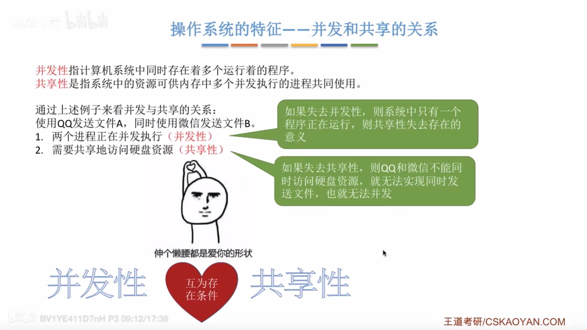

1. 虚拟内存  
    在程序执行过程中，当所访问的信息不在内存时，由操作系统将「所需要的部分」调入内存,然后继续执行程序。  
    另一方面，操作系统将内存中「暂时不使用的内容」换出到外存上，从而腾出空间存放将要调入内存的信息。  
    这样，系统好像为用户提供了一个比实际内存大得多的存储器，称为虚拟存储器。

2. 操作系统的概念：

  

  

  

  

  

操作系统的特征：

+ 并发
+ 共享
+ 虚拟
+ 异步

  

  

  

  

  

  

  

操作系统的发展：

+ 手工操作阶段
+ 单道批处理系统

+ 多道批处理系统
+ 分时操作系统
+ 实时操作系统
+ 网络操作系统
+ 分布式操作系统
+ 个人计算机操作系统

  

  

  

  

  

  

  

  

  

  

  

  

  

