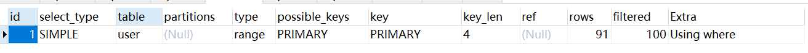

1. **实战调优**
   1. select检查
      1. 用户自定义函数：select后面使用了自定义函数。sql返回多少行，则自定义函数就执行多少次
      2. text类型检查：如果select出现text类型的字段，就会消耗大量的网络和IO带宽，由于返回的内容过大超过了max_allowed_packet设置会导致程序报错
      3. group_concat谨慎使用：group_concat是一个字符串聚合函数，会影响Sql的响应时间，如果返回的值过大，超过了max_allowed_packet设置会导致程序报错
      4. 内联子查询：select后面的子查询，Sql返回多少行，则子查询就会执行多少次
   2. from检查
      1. 使用连接查询时，需要格外注意索引会失效的问题
      2. 关联查询和子查询的效率，在绝大多数情况下关联查询会优于子查询
   3. where检查
      1. 索引列被运算：当一个字段是索引时，如果出现在where条件后面，是不能有任何操作的，否则会导致索引失效
      2. **类型转换**：Int类型的字段，传varchar可以走索引；但是varchar类型的字段传Int值无法走索引。最好就是字段是什么类型，传入的值也是什么类型
      3. 列字符集：字符集不匹配时，可能导致索引失效
   4. group by检查
      1. 前缀索引：group by后面的列有索引，索引可以消除排序带来的CPU的消耗，如果是前缀索引，是不能消除排序的
      2. 函数运算
   5. order by检查
      1. 前缀索引：order by后面的列有索引，索引可以消除排序带来的CPU的消耗，如果是前缀索引，是不能消除排序的
      2. 字段顺序：排序字段顺序需要和索引顺序一致，充分利用索引的有序性来消除排序带来的CPU的开销
   6. limit检查
      1. limit m,n：对于limit m,n分页查询，m越大Sql的耗时就会越长。这种情况下，应该先取出主键id，然后通过主键id跟原表进行join关联查询
   7. auto_increment属性：在InnoDB内部是通过一个系统全局变量dict_sys.row_id来计数，row_id是一个8字节的bigint unsigned，InnoDB在设计时只给row_id保留了6个字节的长度，这样row_id取值范围是0--2^48-1，如果id的值达到了最大值，下一个值从0开始继续循环递增，这种情况下会导致数据丢失
   8. NOT NULL属性：字段应尽量加上默认值，如果列中出现了大量的NULL，会影响索引的稳定性
   9. DEFAULT属性：在创建表的时候，建议每个字段尽量都有默认值，理由同上
   10. TEXT类型：不建议使用TEXT类型，一方面由于传输大量的数据表可能超过max_allowed_packet的设置导致程序报错，并一方面，在表上的DML操作都会变得很慢，建议使用es或对象存储OSS来存储和检索
   11. 索引基数：被索引的列唯一值的个数，唯一值越大越好。例如主键索引id的索引基数为100%，并且为聚集索引，可以直接获取到整行的数据，不需要回表，效率是最高的
   12. 前缀索引：对于边长字符串类型varchar(m)，为了减少key_len，可以考虑创建前缀索引，但是前缀索引不能消除group by，order by带来的排序开销。如果字段的实际最大值比m小很多，建议缩小字段长度
   13. 复合索引顺序：MySql遵循的是索引最左匹配原则，对于复合索引，从左到右依次扫描索引列，到遇到第一个范围查询(>=, >, <, <=, between...and...)就会停止扫描
   14. 时间列索引：对于create_time,update_time这种字段，应该默认创建索引

2. **Explain命令**

   
   1. id：id越大，优先级越高，越先执行；id相同，按照从前往后顺序执行
   2. select_type：查询类型
      1. simple：简单的sql查询，不包含子查询和关联查询等
      2. primary：查询中如果包含任何复杂的子部分，这个就是最外层的
      3. subquery：在select或where中包含子查询
      4. derived：在from列表中包含的子查询被标记为derived(派生)，Mysql会递归执行这些子查询，把结果放到临时表中
      5. union：如果第二个select出现在union之后，则被标记为union；如果union包含在from子句的子查询中，外层select被标记为derived
      6. union reselt：union的结果
   3. table：输出行所引用的表
   4. partitions：匹配的分区
   5. type：判断此次查询使用索引的情况
      1. system：表中只有一行，const类型的一种特例
      2. const：通过主键索引或唯一索引一次就找到，最多匹配一条数据
      3. eq_ref：通常出现在多表的join查询，表示对于前表的每一个结果，都只能匹配到后表的一行结果，并且查询的比较操作通常是=，查询效率较高。或者唯一性索引扫描，对于每个索引键，表中只有一条记录与之匹配，常见于唯一索引或者主键扫描
      4. ref：通常出现在多表的join查询，针对于非唯一或非主键索引，或者是使用了最左前缀规则索引的查询。或者非唯一索引扫描，返回匹配某个单独值的所有行，本质上也是一种索引的访问，它返回所有匹配某个单独值的行，可能会找到多个符合条件的行，属于查找和扫描的混合体
      5. range：检索给定的范围的行，通过索引字段范围获取表中部分数据记录。通常出现在=, <>, >, >=, <, <=, is null, <=>, between...and, in()操作中
      6. index：全索引扫描
      7. all：全表扫描
   6. possible_keys：可能使用的索引，不一定真正地被Mysql使用到
   7. key：当前查询时所真正使用到的索引
   8. key_len：索引中使用的字节数，该列在计算查询中使用的索引的长度在不损失精度的情况下，长度越短越好。如果键是null，则长度为null
      - 字符串
        - char(n): n 字节长度
        - varchar(n): 如果是 utf8 编码, 则是 3  *n + 2字节; 如果是 utf8mb4 编码, 则是 4*  n + 2 字节.
      - 数值类型:
        - TINYINT: 1字节
        - SMALLINT: 2字节
        - MEDIUMINT: 3字节
        - INT: 4字节
        - BIGINT: 8字节
      - 时间类型
        - DATE: 3字节
        - TIMESTAMP: 4字节
        - DATETIME: 8字节
      - 字段属性: NULL 属性 占用一个字节. 如果一个字段是 NOT NULL 的, 则没有此属性.
   9. ref：哪个字段或常数与key一起被使用
   10. rows：显示此查询一共扫描多少行，是个估计值，原则上越少越好
   11. filtered：此次查询条件所过滤的数据的百分比
   12. extra：额外的信息
       1. using index：通过索引查找到数据行。如果同时出现using where，则表示索引列被用来执行索引键值的查找
       2. using where：使用where过滤
       3. using temporary：查询中有使用临时表

3. optimizer trace功能：详细展示了sql语句执行的所有分析、优化和选择过程，能够显示为什么选择这个过程

参考：

1. 敖丙工作以来总结的大厂SQL调优姿势：https://mp.weixin.qq.com/s/nEmN4S9JOTVGj5IHyfNtCw
2. MySQL大表优化方案：https://segmentfault.com/a/1190000006158186

